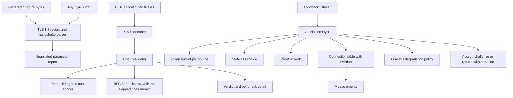

# Sentinel

Course project for **Network and Information Security**, MEng in Computer and Software
Engineering, Faculty of Computer Systems and Technologies, Technical University of Sofia.

## What it is

Sentinel is a defensive transport security toolkit. It reads a TLS 1.3 handshake out of a byte
buffer and reports the parameters that were actually negotiated, it validates X.509 certificate
chains by building the path to a trust anchor and applying the RFC 5280 checks itself rather than
delegating the decision to a library, and it sits in front of a server as an admission layer that
decides which new connections get resources under flood conditions. The point is measurement:
every protection mechanism costs something in latency or throughput, and this project measures
that cost instead of assuming it.

**This is analysis, validation and admission control. It is not an attack tool.** There is no
exploitation, evasion or offensive tooling here, and there will not be. The flood experiments run
only against the project's own listener, which binds the loopback address and nothing else. No
traffic leaves the machine.

## Build

Nothing but a C++20 compiler and CMake. No package manager, no network access at configure time,
no optional dependency that the default build needs.

```bash
git clone https://github.com/Alex-Tsvetanov/sentinel.git sentinel-network-security
cd sentinel-network-security
cmake -S . -B build -G Ninja -DCMAKE_BUILD_TYPE=Release
cmake --build build
ctest --test-dir build --output-on-failure
```

Drop `-G Ninja` to use the default generator. These are the exact commands used to produce the
numbers below, on g++ 15.2.0 (MinGW-w64) under Windows with 12 logical processors.

## Run

One command shows the whole system working: it reads a generated TLS 1.3 handshake, validates a
generated certificate hierarchy case by case, and then measures what each admission control costs.

```bash
cmake --build build --target demo
```

or run the program directly:

```bash
./build/sentinel_demo          # Windows: .\build\sentinel_demo.exe
```

The longer measurement run, with more repetitions and the individual values behind each median:

```bash
./build/sentinel_bench --duration-ms 700 --repeat 5 --honest 2 --flood 4
```

## What it does

**TLS 1.3 handshake analysis.** Record layer framing, ClientHello and ServerHello, and the
extensions that decide the connection: `supported_versions`, `supported_groups`, `key_share`,
`signature_algorithms`, `server_name` and ALPN. Handshake messages are reassembled across records,
because one message may be split over several and a reader that assumes otherwise gets the common
case right and the interesting case wrong. The negotiated version is read from
`supported_versions`, not from `legacy_version`, which RFC 8446 pins at TLS 1.2 for every TLS 1.3
connection. The report names what a passive reader cannot see rather than leaving the reader to
assume it saw everything.

**X.509 decoding.** A DER decoder that rejects indefinite lengths, non-minimal length encodings
and the high tag number form, since a decoder that accepts several encodings of one value is how
two implementations end up disagreeing about what a certificate says. On top of it: distinguished
names, validity, subject alternative names, basic constraints, key usage, extended key usage,
name constraints and key identifiers.

**Chain validation.** Path building from an end entity to a trust anchor by depth first search
over the candidate issuers, then the RFC 5280 checks: name chaining, validity window, basic
constraints and `pathLenConstraint`, key usage, extended key usage, host name matching with the
RFC 6125 wildcard rules, name constraints, unrecognised critical extensions, and a locally
administered revocation list with an explicit fail open or fail closed policy.

**Signature verification is not performed, and the report says so.** It is reported as `SKIP` with
the reason, on every path, next to the checks that did run. The arithmetic belongs in a reviewed
cryptographic library, and depending on one would break the promise that this repository builds
with nothing installed. A report that hides a check it did not run is worse than no report.

**Connection admission.** A per-source token bucket, a stateless cookie in the manner of RFC 4987
so that no state is allocated before a client proves it can receive, a proof of work challenge, a
connection accounting table with eviction, and a graceful degradation policy that tightens the
first three as the table fills. Each one switches on independently, which is what makes the cost
of each one measurable.

## Measured results

One run of `sentinel_bench --duration-ms 600 --repeat 11` on an AMD Ryzen 5 3600 (6 cores, 12
threads) under Windows 11, g++ 15.2.0, Release. Medians over eleven repetitions. The complete
output of that exact run, every repetition included, is committed as
[`docs/measurements/bench_run.txt`](docs/measurements/bench_run.txt), so every number below can
be traced to the values behind it. Another machine will give different numbers; the commands
above reproduce the method.

| Operation | ns per operation | per second |
|---|---:|---:|
| TLS 1.3 handshake scan and report, 2448 bytes | 7 765 | 128 776 |
| X.509 certificate decode, 984 bytes | 8 576 | 116 608 |
| Certificate path build and validate, three certificates | 17 330 | 57 702 |

Cost of one admission decision inside the process, and the same configuration under flood over
real loopback TCP with two honest clients and four clients that open connections and never
answer:

| Configuration | ns per decision | admitted/s | vs baseline | p50 µs | peak table | state bytes |
|---|---:|---:|---:|---:|---:|---:|
| baseline, no mechanism | 8.7 | 4305 | 100.0% | 454 | 0 | 0 |
| accounting | 93.9 | 3614 | 83.9% | 525 | 287 | 7552 |
| accounting + rate limit | 94.9 | 3450 | 80.1% | 516 | 255 | 7912 |
| accounting + cookie | 124.9 | 1919 | 44.6% | 988 | 48 | 1504 |
| accounting + cookie + proof of work | 147.8 | 1671 | 38.8% | 1094 | 44 | 1408 |
| all mechanisms | 136.0 | 1791 | 41.6% | 1027 | 43 | 1384 |

The first row of the decision column exceeded the spread threshold the benchmark applies to
itself and is printed with that label in the output. The baseline decision path is a few
nanoseconds long and scheduler jitter on a shared machine is the same size, so it is reported
for its order of magnitude, not as a precise value.

**What the measurement says.** A decision costs 9 to 148 nanoseconds; an admitted connection
costs 454 to 1094 *micro*seconds. Four orders of magnitude apart. So the drop to 44.6% of
baseline throughput with the cookie on does not come from the computation, and the decisions per
second barely move (12 919 to 11 532). It comes from the extra round trip the mechanism
requires. What that buys, under the same flood: peak table occupancy falls sixfold and retained
state fivefold. The mechanisms people call expensive turn out to be expensive in round trips,
not in CPU.

Proof of work at 12 bits was measured from both sides: 4279 hashes and 0.05 ms for the client to
find a nonce, one hash and roughly 23 ns for the server to check it.

The report in [`docs/`](docs/) carries the full tables and the reasoning.

## Architecture

Four layers, each testable on its own. The byte source supplies bytes and the layers above it do
not care where those bytes came from: a file, a socket, or a fixture built in the test suite all
look the same. That is why the project needs no packet capture library to be useful, and why the
measurements are reproducible.



## Layout

| Path | Contents |
|---|---|
| `include/sentinel/` | Public headers, one per layer |
| `src/` | Implementation |
| `tests/` | The test runner and the suites, one file per layer |
| `apps/` | `sentinel_demo` and `sentinel_bench` |
| `docs/` | The project report, in Bulgarian |

## Tests

A test runner of about a hundred lines lives in `tests/check.hpp` and `tests/test_main.cpp`.
There is no GoogleTest and no Catch2, for the same reason there is no OpenSSL: this repository has
to build on a machine with nothing installed. Every case is registered with CTest individually,
from a list the test binary emits after it is linked, so the CTest entries cannot drift away from
the code.

```bash
ctest --test-dir build --output-on-failure   # 82 cases
ctest --test-dir build -R chain              # one layer
./build/sentinel_tests                       # everything, with per case output
```

## Documentation

The project report lives in [`docs/`](docs/). It is written in Bulgarian, because the subject is
taught in Bulgarian and the layout is normative for the faculty.

```bash
cd docs
latexmk -pdf Main.tex
```

Output goes to `docs/build/Main.pdf`, which is tracked so the report can be read without a LaTeX
toolchain. Places where a human still has to decide something are marked with `\TODO{...}` and can
be listed with `grep -rn 'TODO' docs/chapters docs/Main.tex`.

## Status

- [x] Byte reader with bounds checking, and SipHash-2-4 against the published vectors
- [x] TLS 1.3 record layer, handshake parser and negotiated parameter report
- [x] DER decoder with the strictness X.509 requires
- [x] X.509 certificate decoding
- [x] Certificate path building and validation
- [x] Generated certificate hierarchy with one deliberate defect per case
- [x] Token bucket, stateless cookie, proof of work, connection table, degradation policy
- [x] Loopback load harness and the measurement driver
- [x] Demonstration and benchmark programs
- [ ] Signature verification, which needs a cryptographic backend the default build does not have
- [ ] Reading from a capture file format, which needs a parser for that format

## License

MIT. See [LICENSE](LICENSE).
