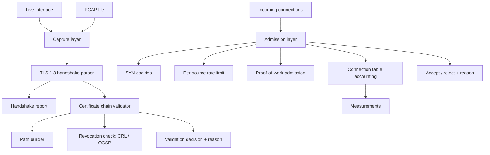

# Sentinel

Course project for **Network and Information Security**, MEng in Computer and Software
Engineering, Faculty of Computer Systems and Technologies, Technical University of Sofia.

## What it is

Sentinel is a defensive transport security toolkit. It reads a TLS 1.3 handshake out of
captured or live traffic and reports the parameters that were actually negotiated, it validates
X.509 certificate chains by building the path to a trust anchor and checking revocation itself
rather than delegating the decision to a library, and it sits in front of a server as an
admission layer that decides which new connections get resources under flood conditions.
The point is measurement: every protection mechanism costs something in latency or throughput,
and this project measures that cost instead of assuming it.

**This is analysis, validation and admission control. It is not an attack tool.** There is no
exploitation, evasion or offensive tooling here, and there will not be. The flood experiments
run only against the project's own test harness on loopback or in local containers. No traffic
leaves that environment.

## Goals

- Parse a TLS 1.3 handshake from a PCAP file or a live interface and report the negotiated
  version, cipher suite, groups and extensions, marking explicitly what a passive observer
  cannot see.
- Build certificate paths to a trust anchor and apply the RFC 5280 checks (validity, signature,
  basic constraints, key usage, name constraints, name matching) as the project's own code.
- Check revocation through both CRL and OCSP, with an explicit, configurable policy for what
  happens when the revocation source is unreachable.
- Implement four admission mechanisms (SYN cookies, per-source rate limiting, proof-of-work
  admission, connection table accounting) that can each be switched on independently.
- Measure the latency, throughput and state-memory cost of each mechanism against a no-mechanism
  baseline, with repeated runs and reported spread.
- Keep every experiment reproducible from a fixed capture file or a scripted local harness.

## Technologies

| Technology | Version / standard | Why |
|---|---|---|
| C++20 | ISO/IEC 14882:2020 | `std::span` gives non-owning byte views for zero-copy parsing; no GC pauses in the path being timed |
| CMake | 3.20 or newer | Standard build for the C++ toolchain; targets make the layer dependencies explicit |
| OpenSSL | 3.x | Cryptographic primitives only (signature verification, digests). The parsing and path logic is this project's |
| libpcap | 1.10 or newer | Reads both live interfaces and PCAP files behind one API, so tests run on fixed input |
| GoogleTest | 1.14 or newer | Unit and integration tests, including malformed-input cases for the parser |

## Architecture

Four layers, each testable on its own. Capture supplies bytes and does not care where they came
from. The parser turns bytes into protocol structures and owns none of them. The validator turns
a certificate chain into a decision with a reason. The admission layer turns connection state
into an accept or reject, also with a reason. Nothing above the capture layer knows whether the
input is live or replayed, which is what keeps the measurements reproducible.



## Build

```bash
git clone <this repository>
cd sentinel-network-security
cmake -S . -B build -DCMAKE_BUILD_TYPE=Release
cmake --build build -j
ctest --test-dir build --output-on-failure
```

These commands describe the intended build. There is no `CMakeLists.txt` yet, so they do
not run today. See [Status](#status).

Requires a C++20 compiler, CMake 3.20+, OpenSSL 3.x and libpcap development headers.
Live capture needs elevated privileges; reading a PCAP file does not, and the tests only read
files.

## Documentation

The project report lives in [`docs/`](docs/). It is written in Bulgarian, because the subject is
taught in Bulgarian and the layout is normative for the faculty.

```bash
cd docs
latexmk -pdf Main.tex
```

Output goes to `docs/build/Main.pdf`. Unfilled facts are marked with `\TODO{...}` and can be
listed with `grep -rn 'TODO' docs/chapters docs/Main.tex docs/references.bib`.

## Status

- [x] Repository scaffold
- [x] Report skeleton with all chapters
- [x] Literature review sources selected (RFC, ISO, ITU, NIST, ENISA, OWASP)
- [ ] Capture layer
- [ ] TLS 1.3 handshake parser
- [ ] Certificate path builder
- [ ] Revocation checking (CRL, OCSP)
- [ ] Admission mechanisms
- [ ] Connection table accounting
- [ ] Local test harness and load generator
- [ ] Measurements
- [ ] Report text filled in

No implementation code exists yet. Everything below the first three boxes is planned, not built.

## License

MIT. See [LICENSE](LICENSE).
